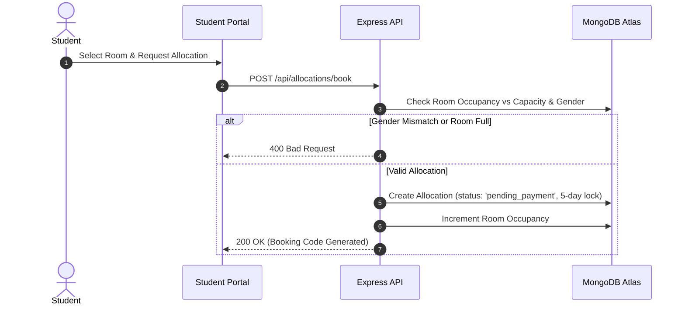
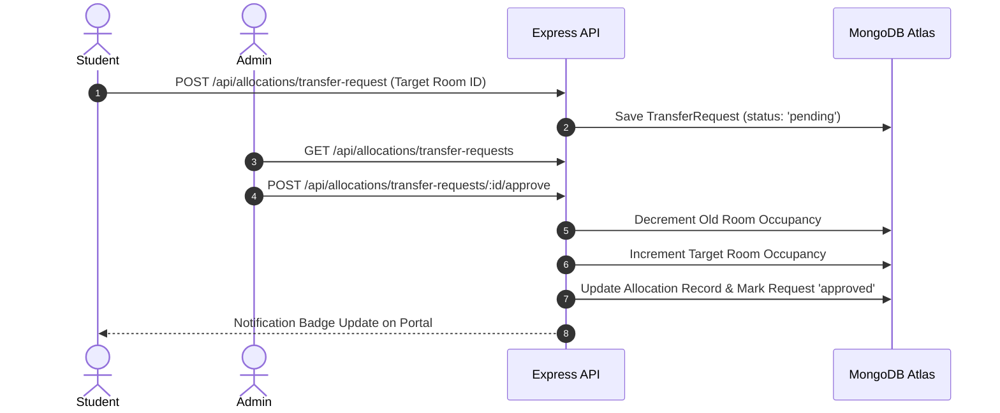

# 🏫 HOSTEL MANAGEMENT SYSTEM (HMS)
> **Final Year Project Documentation & System Manual**  
> *A Modern, Full-Stack Web Application for Automated Student Accommodation, Room Inventory Control, Transfer Request Approvals, and Ledger Management.*

---

## 📋 Table of Contents
1. [Project Overview](#-project-overview)
2. [Key Architecture & Features](#-key-architecture--features)
3. [Technology Stack](#-technology-stack)
4. [Database Schemas & Data Model](#-database-schemas--data-model)
5. [System Workflows](#-system-workflows)
   - [Room Booking & Allocation Workflow](#1-room-booking--allocation-workflow)
   - [Room Transfer Request & Admin Approval](#2-room-transfer-request--admin-approval)
   - [Payment Processing & Automated Expiration](#3-payment-processing--automated-expiration)
6. [API Endpoints Reference](#-api-endpoints-reference)
7. [Installation & Setup Guide](#-installation--setup-guide)
8. [Deployment Instructions](#-deployment-instructions)
9. [Academic Defense Guide for Panelists](#-academic-defense-guide-for-panelists)

---

## 🎯 Project Overview

The **Hostel Management System (HMS)** is an enterprise-grade academic web application designed to streamline student housing operations, automate room allocations based on gender restrictions, manage room transfers, track financial ledgers, and provide real-time notification alerts.

### Business Challenges Addressed:
- **Manual Room Allocation Errors**: Eliminates cross-gender room assignment risks.
- **Double-Booking & Overbooking**: Real-time capacity validation prevents exceeding room bed limits.
- **Unpaid Holds**: Automatically releases room locks if payment is not completed within 5 days.
- **Transfer Bottlenecks**: Provides a formal request workflow requiring administrator approval.

---

## ⚡ Key Architecture & Features

### 👨‍🎓 Student Portal
- **Secure Authentication**: Admission Number and encrypted password authentication via `bcryptjs`.
- **Dynamic Hostel Room Booking**:
  - Auto-selects appropriate block based on student gender (**Batian** for Male, **Nelion** for Female).
  - Automatically recommends available rooms or allows custom selection.
  - Generates unique tracking booking codes (e.g. `BK-89A12B`).
- **Room Transfer Requests**:
  - Students can request room transfers with custom reasons.
  - Status feedback (*Pending*, *Approved*, *Rejected*) displayed on dashboard notification drawer.
  - Read/Unread notification tracking with interactive dismiss buttons.

### 🏢 Administrator Portal
- **Interactive Overview Dashboard**: Key metrics (Occupancy Rate, Total Revenue, Active Students, Pending Requests).
- **Collapsible Sidebar**: Dynamic desktop and mobile navigation drawer with saved `localStorage` state.
- **Room & Inventory Management**:
  - Custom room rate setting (Default: **Ksh 20,000**).
  - Custom bed capacity setting (Default: **2 Beds per room**).
  - Status indicators (**Available**, **Full**, **Maintenance**).
- **Allocation & Approval Engine**:
  - Single-click approval or rejection of student room transfer requests.
  - Cashless payment options (**M-Pesa**, **Bank Transfer**).
  - Automatic room swapping and database updates upon admin approval.
- **Financial Ledgers & Reports**: Exportable audit logs and financial breakdown.

---

## 🛠 Technology Stack

| Layer | Technology | Description |
|---|---|---|
| **Backend Runtime** | Node.js (v18+) | Non-blocking, asynchronous server environment |
| **Web Framework** | Express.js (v4.19) | RESTful API endpoint routing & middleware |
| **Database Layer** | MongoDB Atlas & Mongoose | Cloud-native NoSQL database with strict schemas |
| **Security & Auth** | BcryptJS + Express-Session | Password hashing and HTTP session state management |
| **Frontend UI** | HTML5, JavaScript (ES6+), Vanilla CSS | Lightweight, high-performance client rendering |
| **Design Tokens** | Tailwind CSS (CDN) | Modern material-inspired UI design system |

---

## 🗄 Database Schemas & Data Model

The application uses **MongoDB Atlas** managed through **Mongoose ORM**. Below are the primary entity models:

### 1. `Student` Schema
```javascript
{
  student_id:        { type: Number, unique: true },
  admission_number:  { type: String, required: true, unique: true },
  password:          String, // Bcrypt hash
  gender:            String, // 'male' | 'female'
  full_name:         String,
  email:             String,
  phone:             String,
  course:            String,
  date_of_admission: String,
  next_of_kin_name:  String,
  next_of_kin_phone: String,
  status:            { type: String, default: 'active' }
}
```

### 2. `Room` Schema
```javascript
{
  room_id:           { type: Number, unique: true },
  room_number:       { type: String, required: true, unique: true },
  room_type:         String, // 'Double'
  capacity:          { type: Number, default: 2 },
  monthly_rate:      { type: Number, default: 20000 },
  current_occupancy: { type: Number, default: 0 },
  status:            { type: String, default: 'available' }, // 'available' | 'occupied' | 'maintenance'
  block_name:        String, // 'Batian' | 'Nelion'
  gender_restriction:String  // 'male' | 'female'
}
```

### 3. `Allocation` Schema
```javascript
{
  allocation_id:         { type: Number, unique: true },
  student_id:            Number,
  room_id:               Number,
  allocation_date:       String,
  status:                String, // 'active' | 'pending_payment' | 'cancelled'
  booking_code:          String, // 'BK-XXXXXX'
  lease_expires_at:      String  // 5-day expiration timestamp
}
```

---

## 🔄 System Workflows

### 1. Room Booking & Allocation Workflow


### 2. Room Transfer Request & Admin Approval Workflow


---

## 📡 API Endpoints Reference

### 🔐 Authentication (`/api`)
- `POST /api/login` - Admin authentication
- `POST /api/student/login` - Student login
- `POST /api/student/register` - Student self-registration
- `POST /api/logout` - Clear session

### 🛏 Room Inventory (`/api/rooms`)
- `GET /api/rooms` - List all rooms (filterable by block/status)
- `POST /api/rooms` - Create new room (Admin)
- `PUT /api/rooms/:id` - Update room rate & capacity

### 📋 Allocations & Transfers (`/api/allocations`)
- `GET /api/allocations` - List active allocations
- `POST /api/allocations/book` - Book room (Student)
- `POST /api/allocations/transfer-request` - Request room transfer
- `POST /api/allocations/transfer-requests/:id/approve` - Admin approve transfer
- `POST /api/allocations/transfer-requests/:id/reject` - Admin reject transfer

### 💳 Payments (`/api/payments`)
- `GET /api/payments` - Payment history
- `POST /api/payments` - Process payment (M-Pesa / Bank Transfer)
- `GET /api/payments/balance` - Get student fee balance

---

## 💻 Installation & Setup Guide

### Prerequisites
- **Node.js**: v18.0.0 or higher
- **npm**: v9.0.0 or higher
- **MongoDB Atlas Connection URI**

### Quick Start
```bash
# 1. Clone the repository
git clone https://github.com/njengasandra-eng/HOSTEL-MANAGEMENT-SYSTEM.git
cd HOSTEL-MANAGEMENT-SYSTEM

# 2. Install dependencies
npm install

# 3. Set your Environment Variable
# Windows (PowerShell):
$env:MONGODB_URI="your_mongodb_atlas_connection_string"

# Linux / macOS:
export MONGODB_URI="your_mongodb_atlas_connection_string"

# 4. Start the server
npm start
```

Default access URL: `http://localhost:3000`

### Default Login Credentials
- **Admin Portal**: Username: `admin` | Password: `admin123`
- **Student Portal**: Adm No: `ADM001` | Password: `student123`

---

## 🎓 Academic Defense Guide for Panelists

When presenting this project to examination panelists, highlight these key technical achievements:

1. **Robust Business Logic Enforcement**:
   - Gender separation logic prevents policy violations.
   - Bed capacity caps prevent overbooking.
2. **State Machine Management**:
   - Allocation states: `pending_payment` ➔ `active` ➔ `cancelled`.
   - 5-day automated lease expiration ensures room availability isn't blocked by unpaid bookings.
3. **Database Performance & Reliability**:
   - In-memory data caching layer for lightning-fast reads, synchronized with MongoDB Atlas cloud persistence.
4. **User Experience & Accessibility**:
   - Responsive material design layout with collapsible admin navigation.
   - Unread notification badges that require explicit user interaction to clear.

---
*Developed as a Final Year University Computer Science Capstone Project.*
